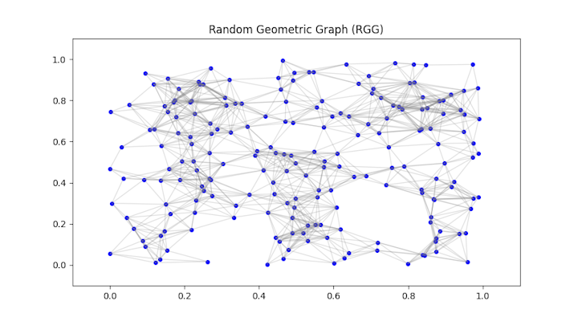

# GraphGen
Generate Random Graph

I am working on a network flow solver in Python.  The first part of the problem is to find the basic circuits of a graph.  This means I need to find the Minimum Spanning Tree (MST).  The edges not in the MST are the basic edges.  Each of these basic edges will create a cycle in the MST.  These cycles are the basic circuits of the graph.

So, step 1 is to find the MST.  There are two algorithms that are recognized for this problem.
  - Kruskal's algorithm
  - Prim's algorithm

A little diversion here.  You can't do graph networks without doing some path finding.  DFS and BFS are a start but Dijkstra is definitely next.  Then, you have to try AStar.  It really is a game changer for path finding.  My favourite resource for AStar is "Red Blob Games".  So, now I have to make another "little" diversion.  It's fun to see AStar working so you need to generate a random graph.  My first attempt was a fully populated mess of nodes and edges.  What you need is a lot of nodes with a difficult path from start to goal.  I saw an image that looked exactly right on ByteVigor A* YouTube video.  The code came from "Pathfinding Algorithms in C#" by Kristian Ekman.  I translated Map.cs to Python and found the logic to be a bit complex.  So, I searched for the graph type and it turns out to be a Random Generated Graph (RGG).  The Wikipedia RGG algorithm is much simpler and produces a similar looking result.  Run the file generate_RGG.py to see the plot.

